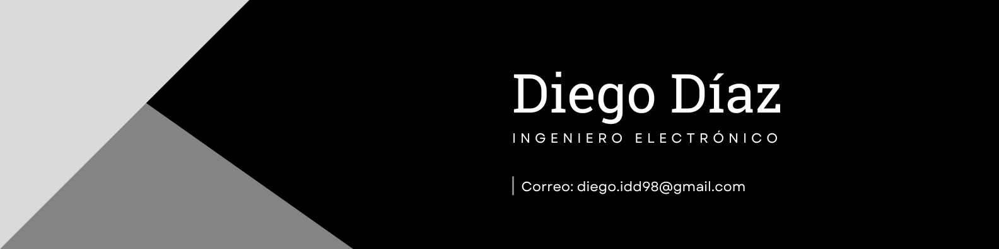

#  Bienvenidos al GitHub de Diego Díaz 

 Ingeniero Electrónico, con experiencia en la
 gestión y desarrollo de proyectos en los campos de
 Sistemas Embebidos, Internet de las cosas e Inteligencia
 Artificial. 

 
 
 

[]

 

	
    
    
    	
        
        
        
        
        
        
        
        
        
        
        
        
        

<!--
**DiegoDiazD98/DiegoDiazD98** is a ✨ _special_ ✨ repository because its `README.md` (this file) appears on your GitHub profile. 

https://github.com/Ileriayo/markdown-badges
https://github.com/CondorCoders/github-readme-profile?tab=readme-ov-file
https://www.youtube.com/watch?v=btlEy8nGOrY&t=243s
Here are some ideas to get you started:

- 🔭 I’m currently working on ...
- 🌱 I’m currently learning ...
- 👯 I’m looking to collaborate on ...
- 🤔 I’m looking for help with ...
- 💬 Ask me about ...
- 📫 How to reach me: ...
- 😄 Pronouns: ...
- ⚡ Fun fact: ...
-->
